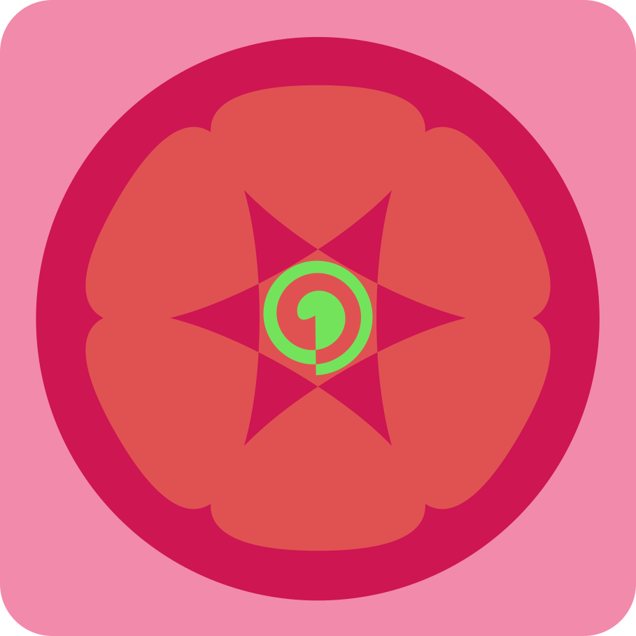

------

Love2D引擎游戏开发框架，基于实体组件的开发模式

------

## 关于Kiss

​        这是一个基于实体组件的love2d沙盒游戏开发框架，提供沙盒世界运行时、UI、物理等模块，简化沙盒游戏开发。

------

## 主要结构

### 实体和组件

​        实体组件是框架的核心结构。实体组件形式的架构对于游戏开发是相当友好的，通过一个个组件去组成一个实体也就是游戏对象，从之前的这个对象能干什么，变成了现在的这个对象有什么，把原本的继承变成了组合，把思考如何进行对象继承，变成了如何拼装一个对象。不再是这个对象继承了什么就是什么，而是这个对象有什么他就是什么，而且是随时变化的，上一秒她是猫猫，下一秒他就是吱吱。

### 场景

​        场景接管了love的回调函数，用于管理实体的更新和绘制。

### 资源管理器

​        资源管理器管理项目的资源，支持图片、字体、音频、瓷砖集以及自定义的资源，受到管理的资源只会加载一次，可以选择一次加载所有资源或者部分资源，也可以在获取时加载一次。

### 碰撞系统

​        碰撞系统分为Port和CollisionWorld。

#### Port

​        Port是碰撞的实现，可以是HC，可以是Box2d，也可以是bump或者是自定义的实现，只需要实现CollisionPort接口即可

#### CollisionWorld

​        CollisionWorld执行Port的实现，他实现的是一个内部与外部分离的系统，外部无法获取碰撞体的实例，外部需要通过一个ID去操作以及创建碰撞体

> 🔨内容施工中🚧