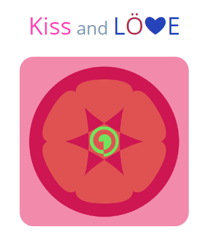

------

Love2D引擎游戏开发框架，基于实体组件的开发模式

------

## 关于Kiss

​        这是一个基于实体组件的love2d开发框架，有很大的灵活性，除了“source/core.”内的文件为必须，其余可以都省略。

 ## 局限性

​        1.使用本框架时，如果需要使用Scene模块，就会禁用love本身的回调，love本身的回调将会由Scene模块进行管理。当然不是所有回调都禁用，只要在"source\core\scene\regulatory_callbacks.lua"内定义的才会禁用，用户可以根据需要去添加或者删除需要的回调。

​        2.就一个👆，实现并不复杂，如何使用还是要看自身

## 主要结构

### 实体和组件

​        实体组件是框架的核心结构。实体组件形式的架构对于游戏开发是相当友好的，通过一个个组件去组成一个实体也就是游戏对象，从之前的这个对象能干什么，变成了现在的这个对象有什么，把原本的继承变成了组合，把思考如何进行对象继承，变成了如何拼装一个对象。不再是这个对象继承了什么就是什么，而是这个对象有什么他就是什么，而且是随时变化的，上一秒她是猫猫，下一秒他就是吱吱。

### 场景

​        场景用于管理实体以及组件的更新（顺序性的），他有一个子类Sandbox，加入的实体需要拥有SandboxObjectComponent组件以使用Sandbox的功能，他会根据SandboxObjectComponent组件的属性进行自动的更新以及绘制顺序排序

### 资源管理器

​        资源管理器管理项目的资源，当前支持图片、声音、字体和瓷砖集，他会在启动时加载assets文件夹下所有的资源文件，可通过全局的core.Resources获取到他的实例，通过core.Resources:get(path,...)方法获取需要的资源，path表示资源的路径，第二个可变参数对应资源创建方法的参数，各有各的不同。无论参数如何，都不会创建第二份资源。对于字体，不同大小的在第一次获取时会创建一份，以后的每次获取都是那份的引用。

### 碰撞系统

​        碰撞系统分为Port和CollisionWorld。

#### Port

​        Port是碰撞的实现，可以是HC，可以是Box2d，也可以是bump或者是自定义的实现，只需要实现CollisionPort接口即可

#### CollisionWorld

​        CollisionWorld执行Port的实现，他实现的是一个内部与外部分离的系统，外部无法获取碰撞体的实例，外部需要通过一个ID去操作以及创建碰撞体

> 🔨内容施工中🚧